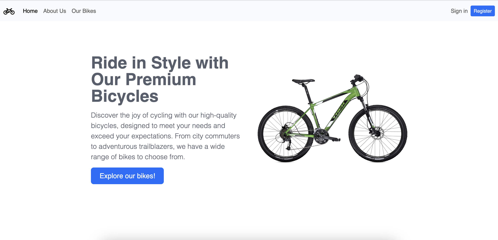
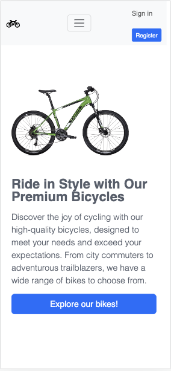

# Bike To Bike - Slide Show Website

## Description

Bike To Bike is a website designed for bicycle enthusiasts who want to learn about bikes and shop for cycling gear. The website features a clean and modern design, easy navigation, and a responsive layout.

### The main features of the website include:

A home page with a slider showcasing featured bikes.
An about us page with content with us and more information about our team.
A user profile page where users can edit their profile information.
Gallery page with the option to switch the display mode. If you are an admin user, you will able to create, edit, read or delete items.

## Technologies Used

HTML
CSS
JavaScript
Bootstrap

## Installation Instructions

To run the project locally, follow these steps:

1. Clone this repository to your local machine.
2. Make sure you are using the Live Server extension.
3. Open the `index.html` file.
4. Right-click on the editor and click on `Open with Live Server`.
5. Open your browser.

## Credits

Or David - 2023.

## Screenshots

### Web

### Mobile

